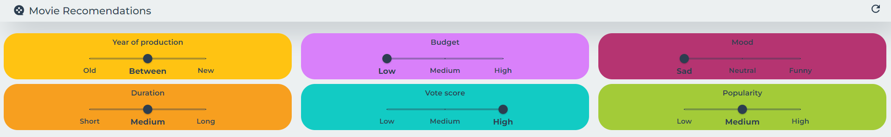
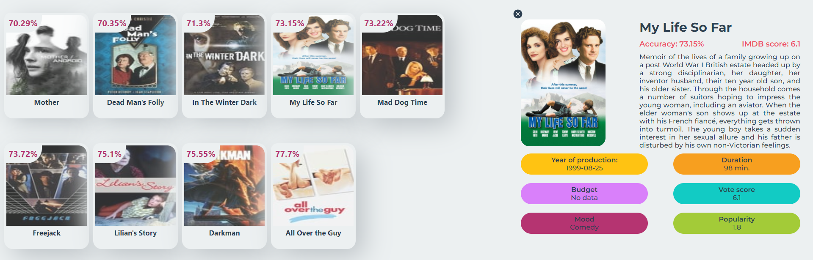

# Movie recomendation system
## Overview
The system takes 6 user inputs:
- Year of production
- Budget
- Mood
- Duration
- Vote score
- Popularity
  



If it finds 9 movies, or the total processing time exceeds 90 seconds, it stops looking and data if presented via WebApp. Posters for movies are scraped from https://www.themoviedb.org/.



Accuracy is calculated on the basis of user inputs, each of which has a specific weighting of importance.
- Year of production: 0.3
- Duration: 0.25
- Vote sccore: 0.25
- Popularity: 0.1
- Budget: 0.1
  
If budged is 0, it is not included in the calculations and the weights of the rest of the values ​​are rescaled.

## Fuzzy sets
```
BUDGET = {
    "low": [0, 1000, 100000],
    "medium": [90000, 124955000, 250000000],
    "high": [20000000, 55000000, 380000000]
}

POPULARITY = {
    "low": [0, 3, 6],
    "medium": [5, 10, 12],
    "high": [10, 15, 547]
}

RELEASE = {
    "low": [1874, 1930, 1960],
    "medium": [1950, 2000, 2005],
    "high": [2001, 2010, 2020]
}

RUNTIME = {
    "low": [0, 20, 60],
    "medium": [70, 90, 130],
    "high": [110, 150, 1256]
}

VOTE = {
    "low": [0, 2, 5],
    "medium": [2, 6, 8],
    "high": [7, 9, 10]
}
```

## Configuration
### Frontend
Install required packages
```
cd src/Web/
npm install
```
Run locally
```
npm start
```
Build 
```
npm run build
```
### Backend
Install required packages
```
cd src/Backend/
pip install -r requirements.txt
```
Run locally
```
python main.py
```
## Run
### Frontend URL
```
http://localhost:3000/
```
### Backend URL
```
http://localhost:3000/
```